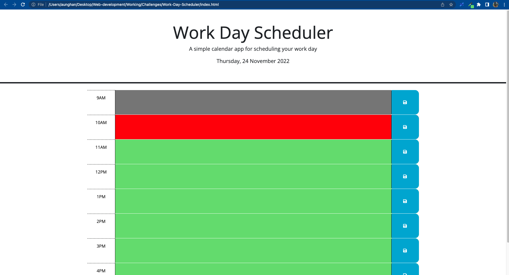

# Work-Day-Scheduler

In this project, I am going to make a simple application that users can add important events to a daily planner.

## Table of Contents

- [Tasks Completed](#TaskCompleted)
- [Links](#Links)
- [Screenshot](#Screenshot)
- [License](#license)
- [Credits](#credits)

## Tasks Completed

- Daily planner to create daily schedule
- Displayed current day at the top of the page
- Time blocks for standard bussiness hours
- Color-coded for time-blocks according to past/present/future
- Event will be saved in local storage when clicked the save button
- Recorded events continue when the page is refreshed.

## Links

Website URL     - https://aungphyohan5.github.io/Work-Day-Scheduler

Repository URL  - https://github.com/Aungphyohan5/Work-Day-Scheduler

## Screenshot

## License

MIT 

## credits

- W3school (https://www.w3schools.com/)

